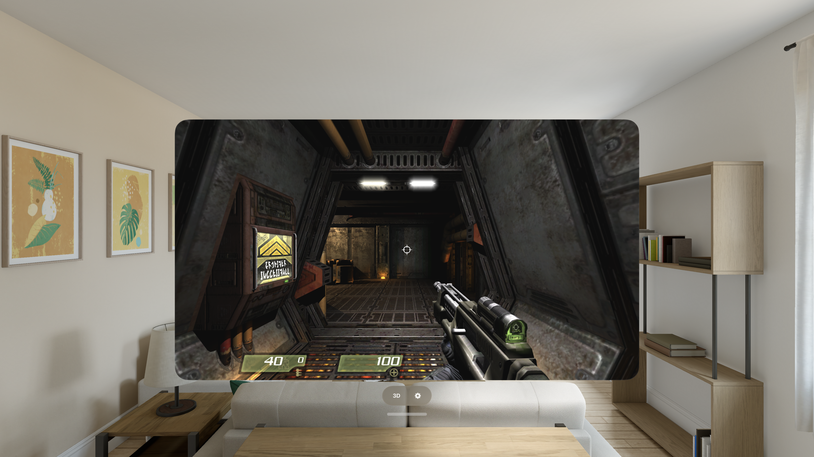

# openQ4 for iPhone & Apple Vision Pro

Play **Quake 4** on your iPhone, iPad and Apple Vision Pro — the full story
campaign, openQ4's offline **Arena Campaign** against bots, multiplayer between
openQ4 players, and on Vision Pro a stereoscopic **3D mode** that puts the game
on a floating screen in your room with real depth.

Built on [openQ4](https://github.com/themuffinator/openQ4), the open-source
replacement for the Quake 4 engine and game binaries, running its Vulkan
renderer natively on Metal through MoltenVK.



---

## Install

**Add the SideStore source** — the easiest path, and openQ4 auto-updates when
new versions ship:

| Device | Source | Source URL |
| --- | --- | --- |
| iPhone / iPad | Quake ports | `https://raw.githubusercontent.com/rebelancap/quake-ports/main/apps-ios.json` |
| iPhone / iPad | All ports | `https://raw.githubusercontent.com/rebelancap/all-ports/main/apps-ios.json` |
| Apple Vision Pro | Quake ports | `https://raw.githubusercontent.com/rebelancap/quake-ports/main/apps-visionos.json` |
| Apple Vision Pro | All ports | `https://raw.githubusercontent.com/rebelancap/all-ports/main/apps-visionos.json` |

openQ4 is in both sources — add either one (Quake ports carries just the
Quake family; All ports carries every rebelancap port).

In [SideStore](https://sidestore.io) / [AltStore](https://altstore.io):
*Sources → **+** → paste the URL*, then install openQ4.

On **Apple Vision Pro**, first install SideStore onto the headset with
[iloader](https://github.com/rebelancap/iloader/releases#release-visionos)
(SideStore/AltStore can't be installed on visionOS the usual way — iloader is
what gets SideStore there). Then add the source in SideStore exactly as above.

**Prefer a manual install?** Download `openq4-*-iOS.ipa` / `openq4-*-visionOS.ipa`
from the [latest release](../../releases/latest) and install it through
SideStore/AltStore yourself (iPhone / iPad can also use
[Sideloadly](https://sideloadly.io)).

The app is large (about 650 MB installed) because it carries openQ4's own
runtime packs; your Quake 4 data comes on top of that (about 2.7 GB).

## You bring the game

openQ4 ships with **no Quake 4 game content** — you must own Quake 4 and
provide your own files. You need the retail **`q4base`** folder, patched to
**1.4.2**. The Steam and GOG releases are already patched; a disc install
needs the official 1.4.2 patch first.

**First launch** asks for the folder: tap **Choose Quake 4 Folder** and pick
your `q4base` (or the Quake 4 folder that contains it). The app checks every
pack against openQ4's table of official 1.4.2 checksums before copying
anything, tells you exactly what is missing or unpatched, shows byte progress
while it copies, and fixes the upper/lower-case file names a Windows install
often has (iOS file names are case-sensitive). Mission-pack maps and the
language packs are picked up if present.

You can also copy `q4base` in with the **Files** app — *On My iPhone / Vision
Pro → openQ4* — and tap **I Added Files — Check Again**.

## Features

- The full **single-player campaign** with saves and autosaves, in-engine
  cutscenes (tap to skip), and the vehicle sections
- openQ4's **Arena Campaign** — five tiers of bot matches with a persistent
  ladder, entirely offline
- **Multiplayer** between openQ4 players: LAN, direct connect, a server
  browser with user-settable master servers, and bots to fill a match
- **Interactive in-world screens** — touch Quake 4's consoles and panels
  directly with your finger
- Music, positional sound and **EFX reverb**; demo recording and playback
- **Game controllers** with a full default layout and menus that step with
  the d-pad; controllers with rumble motors should rumble on weapon fire,
  damage and explosions
- **Touch controls**: floating dual sticks, a weapon wheel, a layout editor,
  and optional **gyro aim**
- Data-only **mods**: drop a mod folder in and pick it in Settings
- English, French, Italian and Spanish
- 60 / 120 Hz presentation on ProMotion displays (the game simulation itself
  runs at Quake 4's fixed 60 Hz)

## Controls

**Touch.** The left half of the screen is a floating move stick, the right
half aims — sensitivity is in real view degrees per screen width, separately
for each axis. Buttons for fire, jump, crouch, reload and the weapon wheel sit
where your thumbs are, with the pause menu and the objectives list at the top
right; *Settings → Touch Controls →
Customize Touch Layout…* lets you drag and resize every one. Tap a console or
panel in the world to use it. The touch controls hide automatically when a
controller is connected.

**Controller** (openQ4's default layout):

| Control | Action |
| --- | --- |
| Left stick / right stick | Move / look |
| Right trigger | Fire |
| Left trigger | Zoom / aim |
| A | Jump |
| B | Crouch |
| Left shoulder | Weapon wheel |
| Left stick click | Run / walk |
| Menu / Options | Game menu |

**Gyro aim** (iPhone/iPad) is in *Settings → Aim*: off by default, with
"While Aiming" and "Always" modes and its own per-axis sensitivity.

## Apple Vision Pro

- **2D**: openQ4 in a resizable window, played with a game controller (the
  touch layer works with pinch when no controller is paired).
- **3D mode**: tap **3D** in the ornament under the window. The game moves to
  a world-locked stereoscopic screen in your room — rendered once per eye
  every frame, with eye-tracked foveated rendering — with screen size,
  distance, height, stereo depth, crosshair distance and room dimming
  adjustable from the gear in *3D Settings*. Tap **Exit** to return to the
  window. The in-game menu is display-only in 3D: use the controller, or exit
  to 2D to change settings.

## Mods

Mods that are **data only** — `.pk4` packs with a `mod.json` or a plain mod
folder — work: copy the mod folder next to `q4base` with the Files app, then
choose it in *Settings → Mods → Active Mod* (it takes effect on the next
launch).

Mods that ship their **own compiled game code** (a `game*.dll`/`.so`/`.dylib`)
**can never run** on iPhone or Vision Pro: iOS only runs code that is signed
into the app, so no native module from outside the app can load. That
includes popular server mods such as q4max.

## Multiplayer — what works

- **openQ4 ↔ openQ4 only.** openQ4 speaks its own network protocol and uses
  its own game modules, so it **cannot join retail Quake 4 servers** (retail
  servers run the 1.4.2 protocol plus mods like q4max that cannot load here).
- **Direct connect** (*Settings → Multiplayer → Direct Connect Address*) and
  **LAN** play work against any openQ4 server.
- The **internet server browser** queries openQ4-compatible master servers,
  including any you add in *Settings → Multiplayer → Extra Master Server*.
  It is only as full as the number of public openQ4 servers, which today is
  small.
- **Bots** work in every mode, and the Arena Campaign is built on them — no
  network needed.

## Requirements

- iPhone or iPad on **iOS 16+**, or **Apple Vision Pro** on **visionOS 2.5+**
- A sideloading tool — SideStore / AltStore
  ([iloader](https://github.com/rebelancap/iloader/releases#release-visionos)
  to get SideStore onto Vision Pro)
- Your own Quake 4, patched to 1.4.2 (Steam and GOG already are)
- About 3.5 GB free: ~650 MB app + ~2.7 GB game data

## Known limitations

- The Vulkan renderer openQ4 uses on Apple devices does not have the desktop
  OpenGL post-processing chain yet (bloom, HDR, SSAO, motion blur) — that is
  upstream openQ4 work in progress.
- The four retail **logo videos** are skipped at startup (openQ4's default);
  turning them on shows a black screen until the menu music starts.
- Multiplayer cannot reach retail Quake 4 servers (see above).

## FAQ

**Is any game content included?** No. You supply your own `q4base`. The app
ships only openQ4's own `baseoq4` runtime packs (menus, fonts, shaders, bot
files) that are part of the openQ4 project.

**My saves from an older build won't load?** A save is tied to the engine
build that wrote it; a few updates that move to a newer openQ4 release cannot
read older saves, and say so in their release notes.

**The app stopped launching after about a week?** Apps sideloaded with a free
Apple account expire after 7 days (paid developer accounts last a year).
SideStore/iloader refresh them automatically in the background — open the
sideloading app and let it re-sign.

---

## Building from source

### What you need

- A Mac with **Apple silicon** and **Xcode 27** (with the iOS and, for Vision
  Pro, visionOS platforms and simulator runtimes installed). Xcode's
  command-line tools provide `git`, `python3`, `rsync`, `patch` and `clang`.
- [Homebrew](https://brew.sh) packages: `brew install xcodegen cmake`
  (verified with xcodegen 2.46 and cmake 4.4; the clean-clone check ran with
  Homebrew's `python3` 3.14 and `rsync` first on `PATH` — the system Python
  3.9 parses and runs upstream's build tools, but a whole build with it has
  not been timed)
- About **10 GB** of free disk for one lane: ~3.3 GB of pinned upstream source
  (`vendor/`, most of it openQ4's pack content) and ~5 GB of build output.
- Network access on the first build (the upstreams and SDL3, OpenAL Soft and
  MoltenVK are fetched at pinned versions).
- For **device** builds only: an Apple Developer account — copy
  `scripts/signing.local.sh.example` to `scripts/signing.local.sh` and set your
  team ID. Simulator builds are unsigned and need no account.

### One command

```sh
scripts/build.sh sim              # iOS simulator; or: device, visionos, visionos-sim
scripts/build.sh sim --public     # the release flavour (developer console compiled out)
```

`scripts/build.sh` runs every step in order — each is its own script and can be
run alone:

| Step | Script |
| --- | --- |
| Fetch the pinned openQ4 + openQ4-game pair (`UPSTREAM.pin`) into `vendor/` | `scripts/fetch-vendor.sh` |
| Build openQ4's `baseoq4` runtime packs with upstream's own pack tools | `scripts/build-baseoq4-paks.sh` |
| Apply this port's patches to a copy of upstream (`build/src-ios`) | `scripts/sync-overlay.sh` |
| SDL3 3.4.10, OpenAL Soft 1.25.2, MoltenVK 1.4.1 (static) | `scripts/build-ios-deps.sh <lane>` |
| The engine archive | `scripts/build-ios-engine.sh <lane>` |
| The SP and MP game modules | `scripts/build-ios-game-modules.sh <lane> both` |
| The app bundle | `scripts/build-ios-app.sh <lane> [--public]` |

Upstream is never edited in place: `vendor/` stays a pristine checkout and every
change this port makes is a patch in `overlay/` applied with `patch --fuzz=0`, so
a patch that no longer applies after an upstream bump fails the build loudly.

### Run it in the simulator

```sh
OPENQ4_GAMEDATA=/path/to/Quake4 scripts/sim-verify.sh --data   # folder that contains q4base/
SIM_APP=build/sim-app-public/Release-iphonesimulator/openQ4.app \
  SIM_SETTLE_SECONDS=150 scripts/sim-verify.sh -- \
  +set com_skipLoadingContinue 1 +map game/airdefense1
```

`sim-verify.sh` installs the app on an *existing* simulator (iPhone 17 Pro Max by
default; `SIM_NAME` / `SIM_UDID` pick another — it never creates one), copies
your `q4base` into the app's Documents with `--data`, launches, takes a
screenshot into `artifacts/sim/`, and shuts the simulator down. Arguments after
`--` go to the engine's command line. The simulator's GPU lacks BC texture
compression, so the script turns precompressed textures off there; real
devices use them.

### Licences

See [`NOTICE.md`](NOTICE.md). In short: the engine, this port's code and its
build scripts are **GPLv3** ([`LICENSE`](LICENSE)); the game modules come from
openQ4-game, are derived from the Quake 4 SDK and remain under **id Software's
Quake 4 SDK EULA** (non-commercial, Quake 4 required) — which is why this app is
only ever distributed free. Third-party licences are in
[`licenses/`](licenses/README.md) and inside every app bundle.

## Credits

- [openQ4](https://github.com/themuffinator/openQ4) and
  [openQ4-game](https://github.com/themuffinator/openQ4-game) by themuffinator
  and contributors — the engine, the Vulkan renderer, the reconstructed Quake 4
  game code, BSE, the Arena Campaign and the replacement UI this port runs
  unmodified underneath its patches.
- id Software and Raven Software for Quake 4, the Doom 3 GPL source release and
  the Quake 4 SDK.
- [SDL](https://www.libsdl.org), [MoltenVK](https://github.com/KhronosGroup/MoltenVK),
  [OpenAL Soft](https://openal-soft.org), volk, Vulkan Memory Allocator and
  stb_vorbis.
- The sibling ports this one learned from:
  [vkQuake-ios](https://github.com/rebelancap/vkQuake-ios) (the SDL3 + MoltenVK
  recipe and the Vision Pro 3D lineage) and the rest of the
  [rebelancap ports](https://github.com/rebelancap/all-ports).

openQ4 for iPhone & Apple Vision Pro is an independent project and is not
affiliated with, endorsed by, or sponsored by id Software, Raven Software,
Bethesda, or ZeniMax Media.
